# Quantitative Analysis: Comparing Portfolio's With Python and Pandas

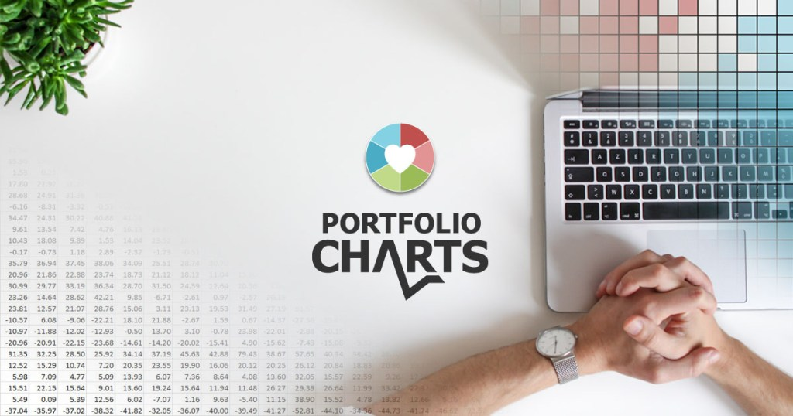

## Introduction

In this quantitative analysis project, I used Python and Pandas to evaluate six major investment portfolios accross various metrics to see which portfolio outperforms the rest. To do this, I created a tool that analyzes and visually organizes each portfolio's volatility, risk, returns, and sharpe ratios from their historical daily returns. The portfolios evaluated include the distinguished Berkshire Hathaway portfolio, two algorithmic portfolios from an undisclosed trading firm (Algo 1 and Algo 2), and three portfolios from large hedge and mutual funds firms. The historical data was provided by yahoo finance and placed into csv files using excel.

Lastly, I used the results from the portfolio analysis to create a custom stocks portfolio and ran it against the other portfolios as well as the S&P 500. 

**Process Outline:**
1. [Read in and Wrangle Returns Data](## Preparing the Data)
2. [Determined Success of Each Portfolio](## Quantitative Analysis)
3. [Created and Evaluatde a Custom Portfolio](## Create-Custom-Portfolio)

---

## Preparing the Data
Portfolios for analysis: The Whale's Portfolios (Berkshire Hathaway Inc, Soros Fund Management LLC, Tiger Global Management LLC, and Paulson & Co.), the Algorithmic Portfolios (Algo1, and Algo 2), and the S&P 500. Their historical data was obtained from Yahoo Finance using Microsoft Excel and converted to CSV format.

For each of the portfolios, I imported their CSV files containing their historical daily returns. Then I joined them into a Pandas Dataframe and cleaned it to prepare it for analysis. Please see Python code: [Whale Analysis](whale_analysis.ipynb)

**View of Cleaned Dataframe:**
  

## Quantitative Analysis

### Performance Analysis

1. Cumulative returns
Based on the figure below, Berkshire Hathaway Inc and Algo 1 out-performs the rest of the portfolios as well as the S&P 500. However, Algo 1's cumulative returns have a longer streak out-performing the rest.

  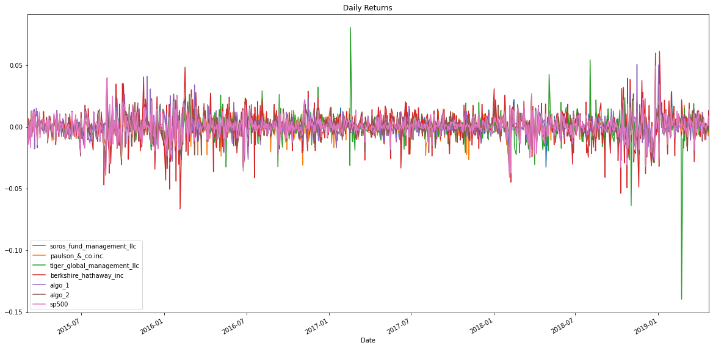

### Risk Analysis

1. Tiger Global Management LLC has the widest daily return spread due to a few outliers, whereas Berkshire Hathaway has an overall denser daily return spread. It can be inferred that the Berkshire portfolio will yield a higher standard deviation if the outliers in Tiger Global get trimmed. Paulson & Co Inc has the smallest spread and the smaller Standard deviation. See below:

  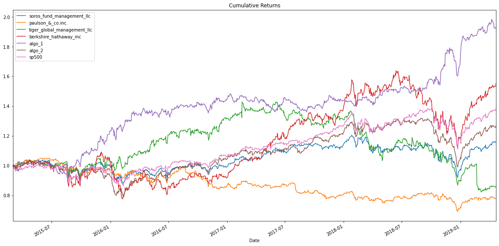
   
2. Berkshire Hathaway and Tiger Global Management LLC demonstrate riskier trends than the S&P 500 due to their standard deviations being higher than the rest. Below is an analysis of each portfolio's overall and annual standard deviations.
 
  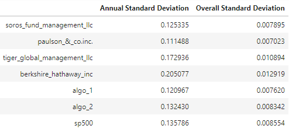
 
### Rolling Statistics

1. Most of the portfolios follow a similar risk pattern as the S&P 500. Tiger Global in the other hand has a more unpredictable risk pattern than the S&P 500.

  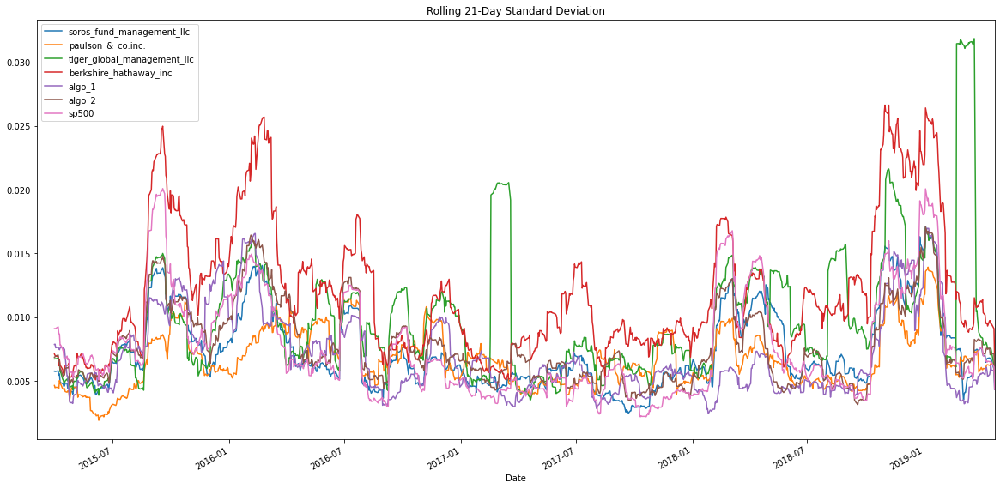
 
  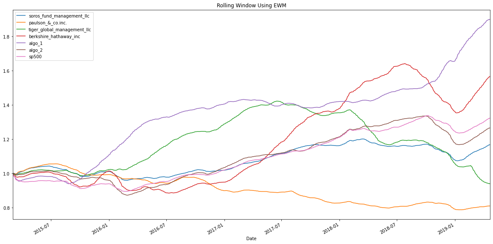  
  
2. Algo 2 portfolio's daily returns most closely mimic the S&P500 since it has a value closest to 1. Close behind is the Soros Fund Management LLC which also has a high correlation rank with the S&P 500.
 
  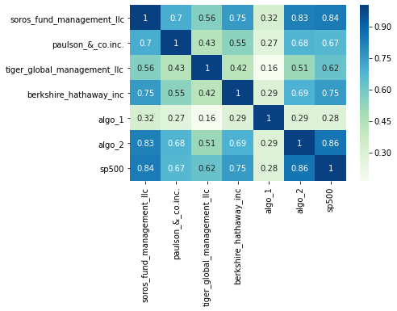
 
3. According to the Pearson Correlation data, Berkshire Hathaway Inc shows a positive relationship with the S&P 500. The beta value of 1.13 supports this data and demonstrates that Berkshire Hathaway Inc is 13% more volatile than the S&P 500. Meaning that if the market moves up by 10%, Berkshire Hathaway Inc is expected to increase by 11.3%. See below:
 
  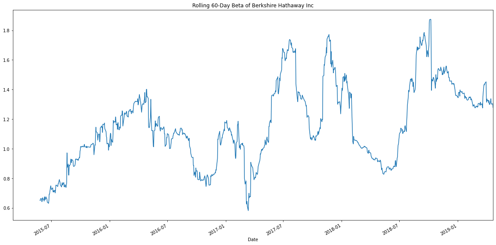
   

### Plot Sharpe Ratios

Investment managers and their institutional investors look at the return-to-risk ratio, not just the returns. Below is a bar graph of each portfolio's sharpe ratios. According to the data, the Algo 1 outperformed every other portfolio, including the market. Its high value demonstrates that it has a lower risk to return than other portfolios. The Algo 2 portfolio, on the other hand, only outperformed Tiger Global, Paulson & Co, and Soros Fund. However, we can improve this analysis by using standard deviations of the annual, quarterly, monthly, and weekly daily returns. Doing so will allow us to evaluate the risk to return more accurately.
Additional analysis of this section can be adding and subtracting stocks from each portfolio to determine which assets will increase or decrease the portfolio's Sharp ratio values. (use stocks to create a better portfolio and run it against the rest).
 
  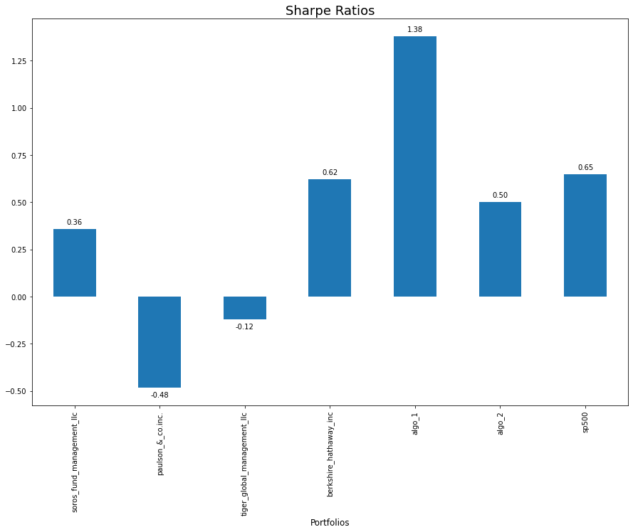

### Create Custom Portfolio

**View of Cleaned Dataframe:**
 
  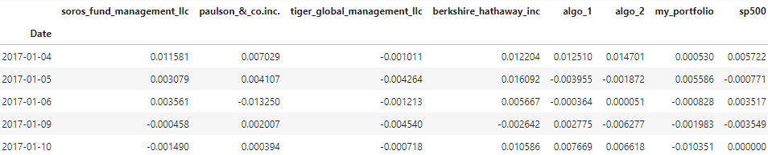
  
### Performance Analysis
**Daily Returns**
 
  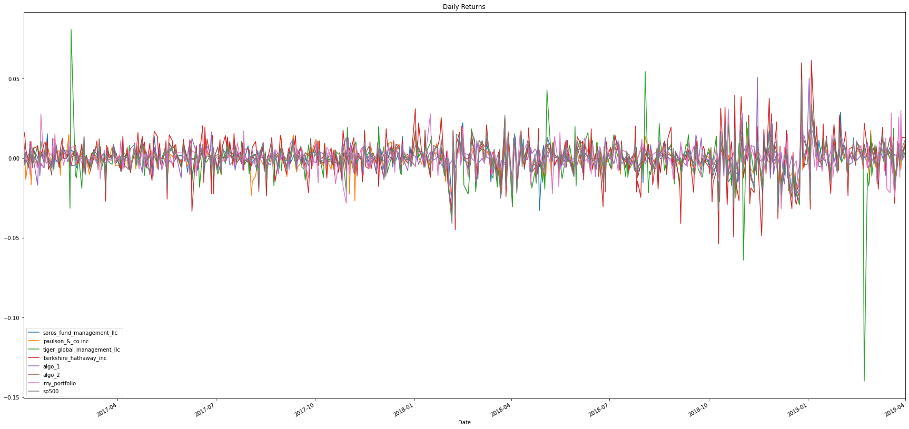
 
 
**Cumulative Returns**
 
  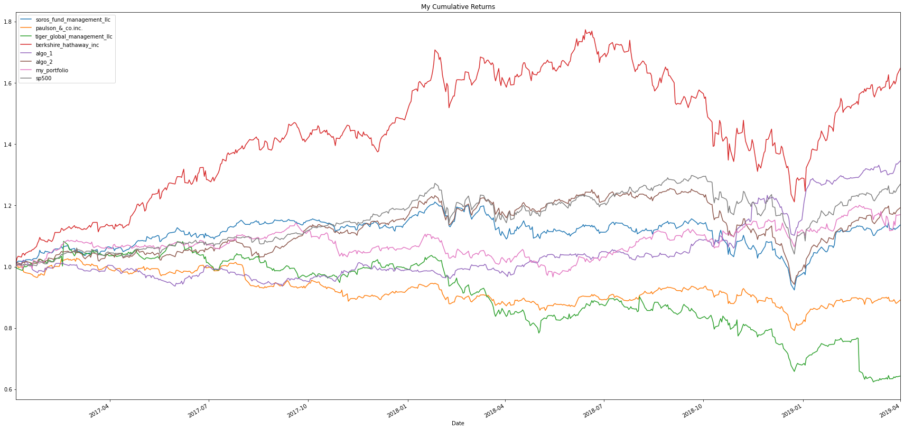
 
 
**Boxplots of Daily Returns**
 
  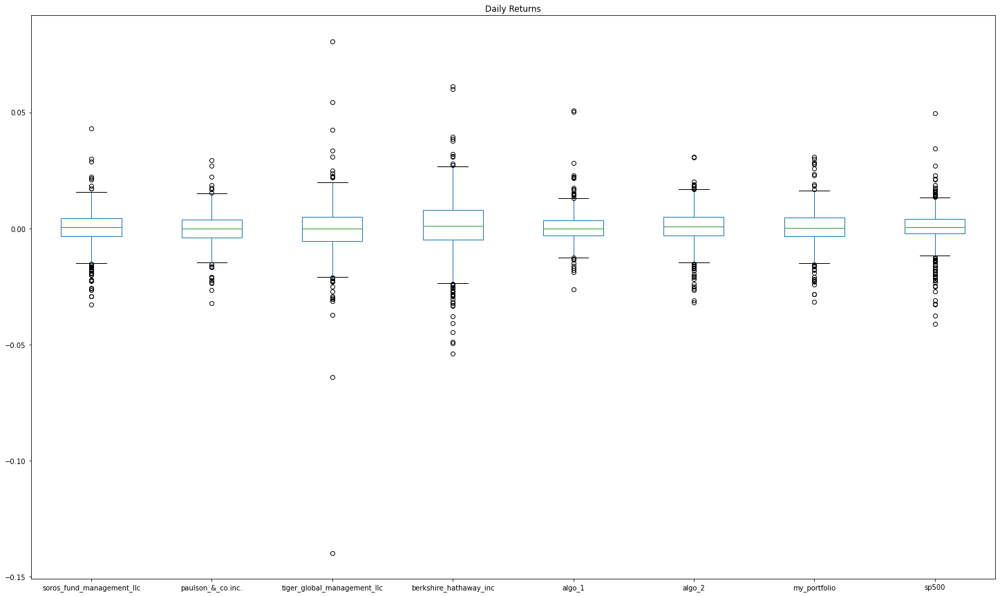
 
 
 
 
**Standard Deviation**
 
  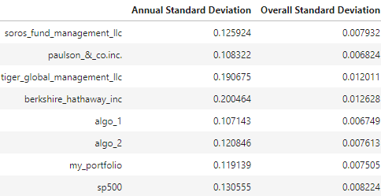
 
 
 
**21-Day Rolling Standard Deviation**
 
  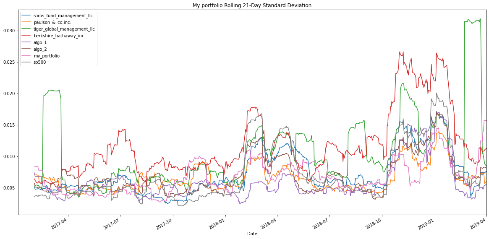
 
 
 
**Rolling Beta of My Portfolio**
 
  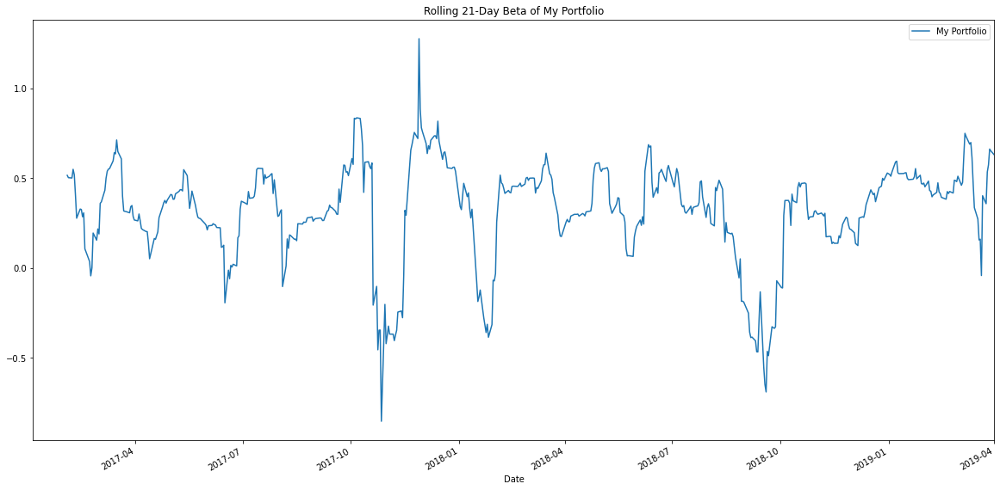
 
The beta value calculated for my portfolio denotes that the portfolio is less volatile than the market. If the market moves in either direction by 10%, my portfolio will also move in the same direction but by 3.6%. My portfolio is essentially more stable but tends to fluctuate less.
 
 
  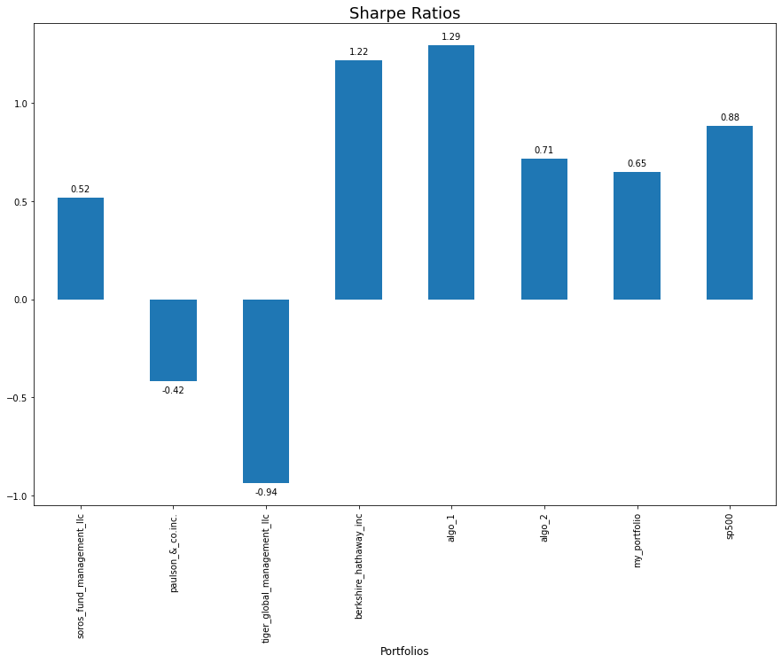
 
 
My Portfolio has a better risk to return (Sharpe ratio) than Soros Fund, Paulson & Co, and Tiger Global, but not the rest. The risk-to-return is low compared to the S&P 500.
 
 
 
**Correlation Matrix**
 
  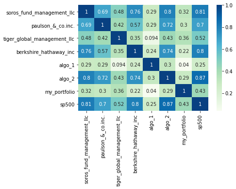
 
My portfolio has a very low correlation with the S&P 500, according to the Pearson Correlation Chart. Adding more assets to my portfolio could potentially increase its performance.
The change in figures from the previous analysis could be the cause of lost days during inner joins of the fataframes with my portfolio data. One way we can avoid this is by using a better API and read in format, or keeping the same window of data.
